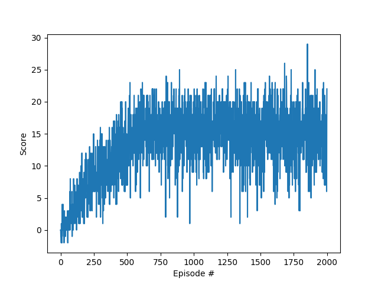

## Implementation

The impementation includes an agent, model and training script. The network is a DQN with a replay buffer. The neural network model is made up of 3 fully connected layers with ReLU as activation function. The chosen hyperparameters are shown in the table below.

| Hyperparameter        | Description           | Value  |
| ------------- |:-------------:| -----:|
| Buffer size      | replay buffer size | 1e5 |
| Batch size      | minibatch size      |   64|
| Gamma | discount factor      |    0.99 |
| Tau | used in soft update of target network parameters | 1e-3
| LR | learning rate | 5e-4 |
| fc1 | number of nodes in the first hidden layer | 64 |
| fc2 | number of nodes in the second hidden layer | 128 |

During training an action is chosen from the state using a greedy policy, the next state is prepared and the observed experience tuple is added to the replay memory. During the learning phase, a small batch of tuples from the replay memory are selected randomly and the model learns from those experiences using a gradient descent update step.

## Results

A training graph of the successful agent is displayed below.

## Improvement Ideas

Several improvements could be implemented, including Double DQN to combat overestimation of action values and Prioritised Experience Replay which helps the agent learn more effectively by giving certain transitions higher probability of being sampled. Additionally, a Dueling DQN architecture can help estimate the state values and the advantage of each action separately and thus reduce unnecessary coupling between the two.