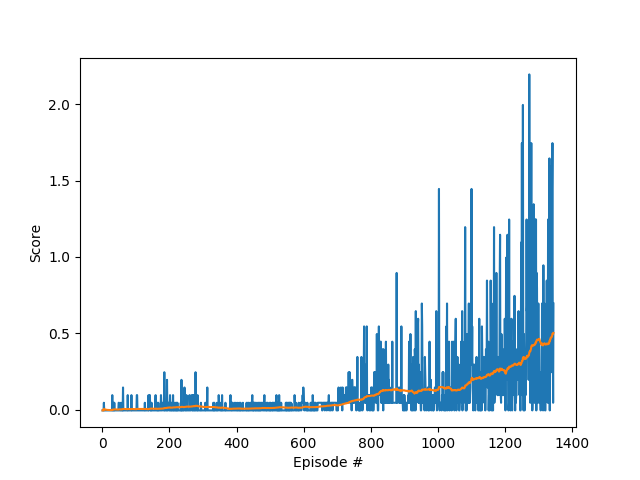

## Implementation

This implementation is based off of the project 2 implementation. The impementation includes an agent, model and training script. The network is a DDPG (extension of Q-learning for continuous spaces) with a replay buffer. The neural network models inlcude an actor and a critic. The actor implements a policy to deterministically select the best actions from the states and is trained using the gradient from maximizing the estimated Q-value obtained from the critic (when the actor's best predicted action is fed as an input to the critic). The critic, on the other hand, implements the Q function and is trained as in Q-learning.

The actor is made up of 3 fully connected layers with `relu` as an activation function and `tanh` for the output layer. The critic is made up of 3 fully connected layers with `relu` as an activation function.

The hyperparameters that are used during training are shown below.

| Hyperparameter |                   Description                    | Value |
| -------------- | :----------------------------------------------: | ----: |
| BUFFER_SIZE    |                replay buffer size                |   1e6 |
| BATCH_SIZE     |                  minibatch size                  |   256 |
| Gamma          |                 discount factor                  |  0.99 |
| Tau            | used in soft update of target network parameters |  1e-3 |
| LR_ACTOR       |            learning rate of the actor            |  5e-5 |
| LR_CRITIC      |           learning rate of the critic            |  6e-5 |
| WEIGHT_DECAY   |                 l2 weight decay                  |  1e-4 |
| EPSILON        |            coefficient for the noise             |   1.0 |
| EPSILON_DECAY  |      decay coefficient for the noise factor      |  1e-5 |


Hyperparameters used in the model are in the table below

| Hyperparameter |                   Description                       | Value |
| -------------- | :-------------------------------------------------: | ----: |
| fc1_units       |  number of nodes in the 1st fully-connected layer  |   400 |
| fc2_units       |  number of nodes in the 2nd fully-connected layer  |   300 |

There are 2 agents, 2 available actions and each agent observes a state vector of size 24. During training, the environment states for each agent are acquired from `env_info`, the scores for each agent are initialized and the agent is reset. Then, at each timestep actions are inferred using the `actor_local` network, and noise is added to each one. These actions are used in the environment and new states and rewards are returned from it. Then, the agent's `step` function is executed which samples from the memory buffer and learns from its experiences at every 10 time steps and whenever there are enough samples in the memory buffer.

The actor network learns through backpropagation with an Adam optimizer. The critic depends on the predicted next-state actions to calculate its own Q targets for the next time step. Then the current Q targets are calculated with

```
Q_targets = rewards + (GAMMA * Q_targets_next * (1 - dones))
```

The local critic network is used to calculate the expected Q values and the mean squared error between the expected and the target Q values gives the critic loss. Then, the critic uses backpropagation (with clipping gradients) and the Adam optimizer to learn. Finally, soft updates are applied to both networks and the noise is reset to the mean.

## Results

A training graph of the successful agent is displayed below.



## Improvement Ideas

The D4PG algorithm as described in [this paper](https://openreview.net/pdf?id=SyZipzbCb) can be used to improve how the network works by introducing N-step returns and prioritised experience replay.

Additionally, I'd explore PPO for achieving state-of-the-art performance.
